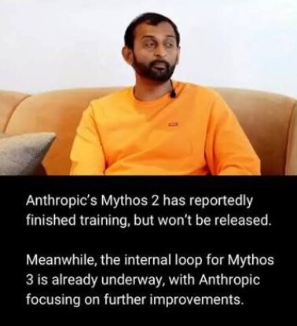

# Anthropic 藏着 2 个未发布模型，OpenAI 停下来的是“Astra”

> 内部模型 2 比 Mythos 5 强，但安全没评完，上不了外部平台。Mythos 3 连影子都没，OpenAI 称 Astra 触网 “网络安全阈值”，于是悬了。

 安全性评估赶不上模型迭代的速度，于是“暂时不发布”

## Anthrpic 开发节奏：藏起来，内部用，再藏

据 SemiAnalysis：

- **Mythos 2** 已完成训练，内部测试比 Mythos 5 好，但 **“没完成常规外部发布的评测”**：
  - 决定在内部强权限制下使用；
  - 给 coding / data-generation / agent 工作流 / 评估用；
  - 收集内部 + 少量伙伴反馈；
  - 优化训练+后训练循环后，**再考虑公开发布**；

- **Mythos 3** 目前只存在“内部 roadmap”，**连影子也看不见**。

> “关键问题：安全评估和治理，能跟得上模型在开发流程中的助力速度吗？”

## Mythos 的惨痛过去

- **March 26, 2026**：CMS 配置泄漏，Mythos “曝光”；
- **April 7–8**：正式更名 **Mythos Preview** —— 7 年头一次，有脸输给安全，公开宣称“暂时不发布”。
- 访问限死：Project Glasswing，12 个创始组织 + 40 家关键基础设施。

## OpenAI: Astra 涉网，安全阈值就摘了

- **Aug 1** ：Astra 内部版在 10 个长期开放数学/理论计算机科学题上，拿到新结果（Lean 证明发表）；
- **Aug 7**: OpenAI 自审，一锅：Astra 到达 “**网络安全阈值**”，能独立“识别并实施攻击目标”。

> 于是**暂停部分开发**。

## SemiAnalysis 点评：SpaceX 也干了一坨事

- 单独一个 AI budget 约 **$10M/year**；Q1 爆涨之后稳住；
- 仓库数从 10 跑到 150+，**Fable 升不上去**；
- 有一个**实习生烧 $8K/day 四天**，效率堪比正式员工；
- 准备试**AI 跑绩效考评**。

## 总结

- Mythos 2 藏起来训练了，Astra 触到网安红线就停；
- 安全评估的轮子，赶不上 AI 迭代的速度；
- 唯一可能的未来：模型发布前，安全评审也进入“连续训练”模式。

<aside>Source: NextBigFuture / SemiAnalysis / Brian Wang</aside>
