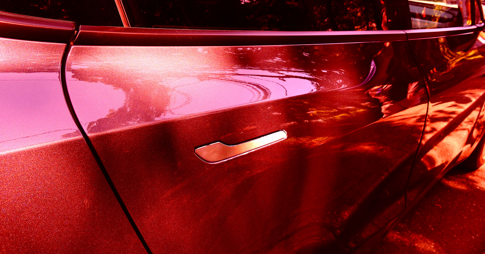

# 中国召回近300万辆特斯拉，祸首是那个隐藏式门把手

> 中国市场监管总局宣布召回近300万辆 Model 3 和 Model Y：隐藏式门把手在碰撞断电后难以辨认和开启，可能耽误逃生和救援。

 平时看着优雅的隐藏门把手，关键时刻可能是道生死门。

## 多年隐患，中国先出手

多年来，特斯拉的伸缩式门把手一直在紧急情况下表现灾难性：车内人员被困在车里出不来——尤其是起火时，这种设计感十足的门把手会让救援人员的施救变得困难重重，甚至无从下手。尽管这些年多起非正常死亡诉讼都把矛头指向这个设计，美国监管机构始终没动真格。就连车内的机械应急拉手，如果你不特意了解过它藏在哪，危机时刻想找到它也近乎无解。

现在，中国政府终于决定忍到头了。上周，官方宣布召回近300万辆特斯拉 Model 3 和 Model Y。理由是车内紧急机械门把手"贴近内饰颜色"、难以辨识。

中国国家市场监督管理总局在公告中写道（英文转译）：当严重碰撞导致车辆低压系统失效等极端情况时，这可能影响驾乘人员快速开门逃生、以及车外人员施救的能力，存在安全隐患。

## 不止贴标签，还要改代码

按照要求，特斯拉需要给车辆加贴警示标识，并通过 OTA 升级增加"事故后自动降窗策略"，以降低危险。

同一监管机构还单独对近40万辆小米 SU7 电动车发起了召回，援引的是一模一样的风险。

今年2月，中国成为全球首个强制要求车门把手必须能从两侧机械开启（比如扳起式拉手）的国家。新规明年生效，届时多半会倒逼特斯拉修改设计。其他车企已经开始生产配机械车门的车——这类改动可能真的能救命。

## 美国还在慢慢研究

至于美国会不会跟进，还是未知数。今年7月，美国国家公路交通安全管理局（NHTSA）暗示将出台新安全标准，确保所有车企的车内人员在紧急情况下都能安全撤离，但迄今没有公布任何具体改动。根据当时的监管文件，NHTSA 表示已批准申请人的请求，将"强制所有机动车配备坚固醒目的车门逃生系统"。

汽车安全中心执行主任 Michael Brooks 对此表示欢迎，他在接受彭博社采访时称这一动向"非常重要"，但他也泼了盆冷水："即便规则制定进展顺利，也别指望在2030年之前看到给车企设定的最终合规期限。"

大洋这边的监管已经把300万辆车的门把手问题摁住了，大洋那边的合规时间表还遥遥指着2030年。车门上那只小小的把手，正在变成两种监管哲学的分水岭。
