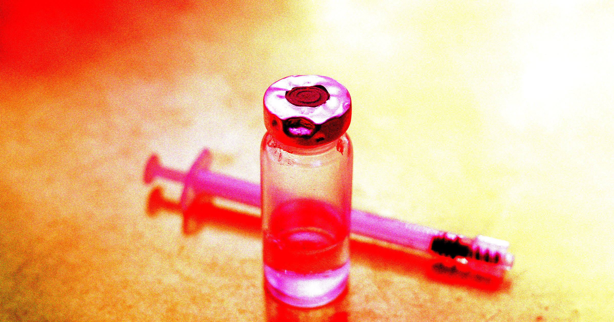

# 还没获批的减肥药黑市卖疯，已经有人肝脏出了事

> 三靶点减肥药 retatrutide 连 FDA 的审评都还没递交，黑市仿冒版却已涌进美容院和社交平台。澳大利亚已有患者因注射假药严重肝损伤。

 药还在临床试验阶段，假货已经先一步"上市"了。

## 药还没批，货先上了街

随着 GLP-1 类减肥药的爆火，一个怪现象正在上演：山寨版新药涌上街头速度，远比正版拿到监管批准快得多。最近几个月，一款名为 retatrutide 的新兴减肥药的黑市版本，迅速渗进了商场美容院和社交媒体交易平台。据 Axios 报道，这款药甚至还没有提交给美国食品药品监督管理局（FDA）接受审评，更别提获批了——全美公共卫生专家对此忧心忡忡。

retatrutide 由制药巨头礼来研发，是一种三激素受体激动剂，能同时激活三条代谢通路：大名鼎鼎的 GLP-1，外加 GIP 和胰高血糖素受体两种特殊细胞蛋白。三种激素联手，理论上可以降低食欲、稳定胰岛素水平、还能提高身体的卡路里消耗量。

对想减肥的人来说，这套三重打击听起来简直是梦中情药。按礼来自家投资者通报的说法，早期试验中受试者平均减重达到71.2磅（约32公斤）。当然，盈利药企的投资人通报，听听就好。

## 想用正版？还得等到2027年

现实是：礼来计划到2027年才向 FDA 递交申请。换句话说，眼下市面上流通的任何版本的 retatrutide，都是极其可疑的东西。医学研究者理论上可以从实验室试剂公司搞到这种物质，但美国没有任何一家医疗机构被授权将它作为减肥药开出处方。

铤而走险买黑市货的后果可能很严重。就在本周一，澳大利亚广播公司（ABC）报道，一名患者因使用了一瓶假冒 retatrutide 而出现严重肝损伤。原因可能是某批未受监管的药物受到了污染，但由于这款药的临床测试还处在非常早期的阶段，澳大利亚卫生部门也没法下定论。

能确定的是：使用来路不明的多肽类药物风险相当大。为这名患者治疗的肝移植专科医生 Marie Sinclair 说，使用者"可能会皮肤发黄、出现黄疸，这对患者来说非常可怕，而且病情会急转直下"。

## "承诺不等于证明"

到目前为止，礼来已经对多家美容医疗诊所、药房和其他药品经销商提起了六起诉讼，理由都是销售黑市版 retatrutide。

循证医学协作组织主席、药学讲师 John Hertig 在一份声明中说："有前景不等于被证明有效。消费者的兴奋和需求，不应该让商业销售跑在科学证据前面——毕竟确定一种药如何安全有效地使用，靠的是扎实的证据。"

"患者理应得到有严格证据支撑的治疗。"他接着说。

一支还锁在实验室里的减肥针，已经在美容院的针剂盘里排队了。这条从实验室到黑市的捷径，代价正写在第一批病人的化验单上。
