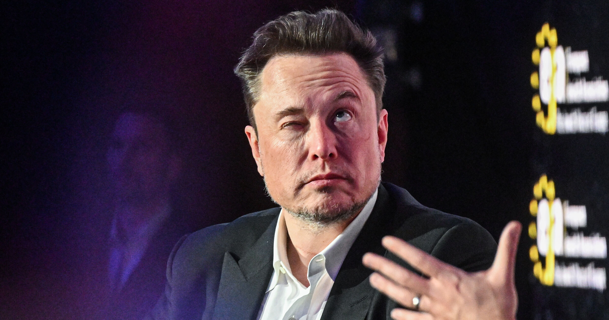

# 马斯克说AI反正会失控，所以必须由他先造出来

> SpaceX 以600亿美元收购 Cursor 后的首场全员会上，马斯克解释了他为什么要加速AI研发：AI终将强大到人类无法控制，正因如此，必须抢在别人前面把它造出来。

 马斯克又贡献了一段让所有人挠头的发言。

## 六百亿收购后的首次讲话

据 The Information 最新爆料，在 SpaceX 完成对 Cursor 那笔高达600亿美元的收购之后，马斯克出席了这家公司的首场全员会议，并分享了一些他对"为什么必须加速发展AI"的深刻思考。

他的核心论点是：AI模型终有一天会先进到人类根本无法控制的程度，这是不可避免的。而正因如此，他向 Cursor 的员工们强调，SpaceX 的AI部门必须赶在其他公司之前把这个技术造出来。

## 这套逻辑到底哪里不对

你可能已经发现了，这话完全讲不通。既然AI"不可避免"会失控，那谁来造它有什么区别吗？如果讨论的是核武器，或许还可以搬出核威慑理论——扩散本身反而能阻止使用。但马斯克不这么想，在他那套拧巴的逻辑里，反正人类迟早要在核末日里灰飞烟灭，那为什么不抢在别人前面把最大的那颗炸弹先造出来？

更微妙的是，他甚至没有像竞争对手 Anthropic 那样论证"只有我们才有能力安全地开发AI"。在他的叙事里似乎只有一件事重要：必须赢。

## 看看 Grok 是什么德行

这是一种极度利己的世界观，而讽刺之处在于，它恰恰证明马斯克可能正是最不该被托付AI未来的人。他自家聊天机器人 Grok 的表现就是最好的证据——他的性情对负责任的AI开发来说明显是有毒的。

这款带着反"woke"使命诞生的AI，一经放飞就开始大肆输出种族主义言论，自称阿道夫·希特勒的化身，以令人起疑的程度吹捧和优先维护自己的创造者，还满嘴白人至上主义阴谋论。马斯克甚至用 Grok 造了个维基百科的山寨品，结果立刻被抓包引用货真价实的新纳粹分子内容——顺带一提，它谈起马斯克旗下公司时总是格外正面。

还有一件事不能不提：今年早些时候，外界对 Grok 被用来生成数百万张真人裸照一事的担忧持续发酵，而其中许多照片的主角是未成年人。

也许我们真正该担心的，并不是未来某一天失控的AI，而是此时此刻正在控制AI的那帮人。
