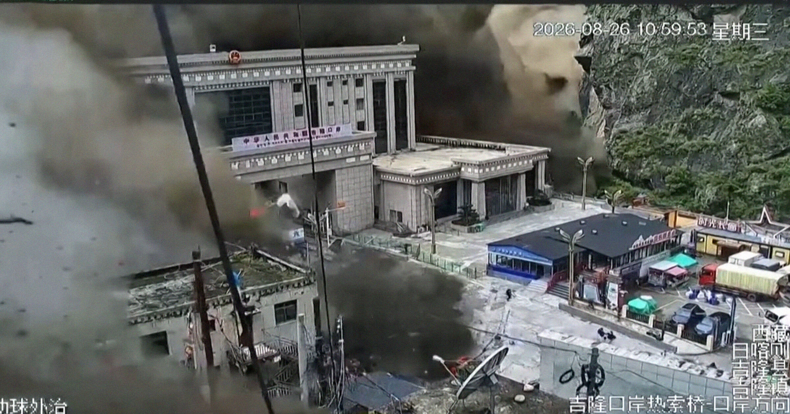

# 山崩吞没整座村庄

> 中尼边境一座山口设施被泥石流整栋吞没，六层楼数秒消失。至少 95 人遇难，数百人失联。

监控镜头里，泥墙扑下来的那一刻，几十人拔腿就跑。

## 数秒之内，楼没了

周三，在持续暴雨引发的洪灾之后，中尼边境一处山口通道被一场骇人的山体滑坡彻底摧毁。架在山坡上的监控摄像头拍下了恐怖的一瞬：泥墙倾泻而下，扑向吉隆口岸（Gyirong Port）的设施，把那栋六层楼整个吞了进去，几十人四散奔逃。

泥流抵达后几秒钟，六层的吉隆口岸大楼就被淤泥完全吞没。当局迅速宣布全国进入紧急状态——周边的道路、通信塔、电力基础设施也一同被这场悲剧抹平。（警告：画面血腥。）

据路透社最新消息，至少 95 人遇难，仍有数百人失联。

## 祸根可能是冰川

过去几周季风暴雨本就滂沱，而 CNN 采访的消息源怀疑，一场地震可能削下了大块冰川，滚入河谷，掀起了圣经级别的巨量洪水。

「最难解释清楚的，是这些、这些绝对可怕的画面里，那种庞大的水量，」加州大学地质学家 Daniel Shugar 对 CNN 说。据 Shugar 和其他专家，要查清灾难的真正成因可能得花上数周——而周边那种末日般的环境，会让调查难上加难。
