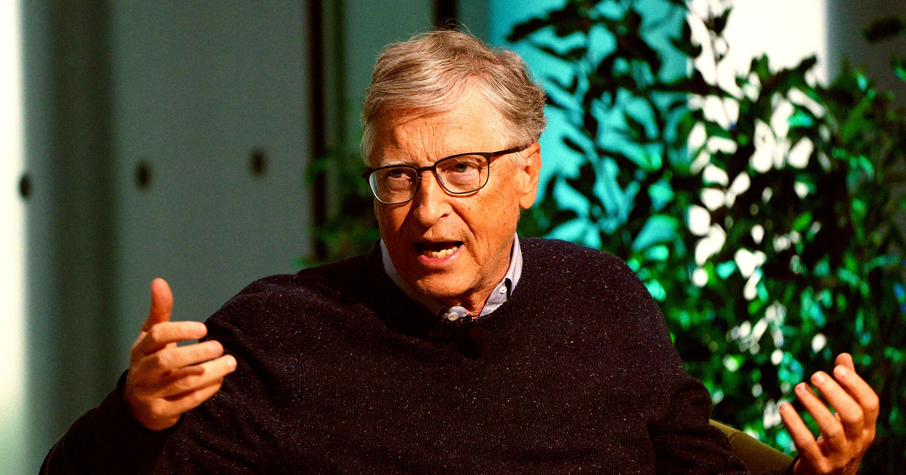

# 比尔·盖茨宣称自己是全球第一个为AI担忧的人

> 长期乐观的比尔·盖茨突然转向，高呼 AI 将摧毁就业、重创经济，却惊讶于"竟只有我一个人在喊停"。

从最乐观的布道者，到最焦虑的警告者。

## 迟来的警觉

比尔·盖茨怎么也想不通：为什么没有人和他一样，为 AI 忧心忡忡。

在一篇近 6000 字的长文（顺便一提，本月科技大佬的 6000 字 AI 长文不止这一篇）加一轮媒体造势里，这位亿万富翁一改多年来的盲目乐观，骤然对技术将如何塑造未来发出警告：它会抹掉工作岗位，让经济一片荒芜。

## "我被沉默震聋了"

"AI 要么是有史以来最伟大的均衡器，要么是最糟糕的不公之源，"他在文中写道。他甚至对 Semafor 坦言，自己"处在震惊中，仿佛我是第一个站出来说'这太疯狂、太离谱'的人"，并抱怨"我被一片沉默震聋了"。

可这话经不起推敲。自 ChatGPT 爆红起，经济学家就在反复预警生成式 AI 会冲击就业；连 AI 公司自己也在复述同样的警告。更别提它早已在制造虚假信息、助长心理健康危机等方面露出獠牙。

## 不一样的技术革命

盖茨辩称，与过去那些"创造的岗位多于摧毁"的技术革命不同，AI 会反其道而行，几乎触及每一个领域。"没有哪份工作不受影响，"他对 Semafor 说，"它之特别，不在于速度，而在于广度——这让它在演化史上绝无仅有。"

他还透露，自己已写完一整本关于"如何避免 AI 设计的病毒引发大流行"的书，并断言"生物恐怖风险现在是自然大流行风险的 50 倍"。

## 沉默的共谋？

盖茨最刺眼的一处指控是：科技领袖们明知风险，却因利益而刻意淡化。"私下里，那些懂行的人在私下非常担忧，"他对《纽约时报》说，但彼此却在劝："嘿伙计，别那么说，这对我们不利——我们正要募集下一个万亿。"

当然，盖茨远非反 AI。他真正的忧虑之一是：若不善加约束，失业的群氓可能迁怒于这项美好技术，让它无法施展全部潜能。他的公众形象近来因与已故性犯罪者爱泼斯坦的过往而受损。不过，若他真能成为科技精英对待 AI 反弹的晴雨表，或许意味着这项技术的落地与监管，正迎来转向。
