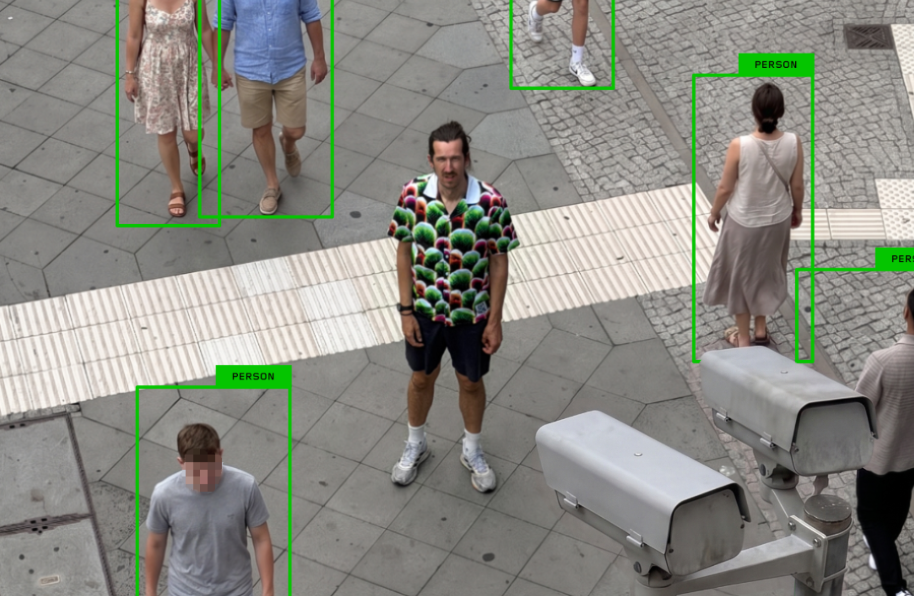

# 设计师造出全球最丑夏威夷衫，专门躲避 AI 监控

> 别人拆摄像头塔，这位德国设计师反手做了一件丑到离谱的夏威夷衫——专治 AI 监控的识别算法。人看是催眠花纹，机器看是一片虚无。

用最丑的图案，打最狠的盲区。

## 用「丑」当武器

当一些隐私倡导者还在琢磨怎么锯掉监控摄像头塔时，德国设计师 Simon Weckert 选了个不按常理出牌的工具：一件你见过最丑的 aloha 衬衫。据 Dezeen 报道，这件衫是冲着「AI 集成的监控系统」设计的——让人穿了之后「隐身」。

秘诀在配色和图案的混乱搭配。它丑得刻意，正是为了搅乱监控算法的判断。Weckert 解释，是「恶心颜色和形状的相互作用」让穿者从检测里消失。

## 「人」在机器眼里只是统计包

「AI 系统有好几层，它从没学过『人』到底是什么——它学的是数百万张训练图里，人『统计上长什么样』。」Weckert 对 Dezeen 说，「对机器来说，『人』是一捆视觉统计量。而这，恰恰是它的软肋。」

衣服上那些粉、橙、绿混在一起的大色块，目的是「打断身体轮廓的连续性」，「这样检测器就没法把各个部件拼回一个完整人形」。

「人看它像一块几乎能催眠的布料；AI 模型看它，啥也不是。」他说。

## 讽刺的是，图案也是 AI 画的

更妙的反讽：Weckert 是用 AI 来设计这图案的，靠一种叫「对抗回路」的反复试错。这让人想起威廉·吉布森 2010 年小说《零历史》里虚构的那件「世界上最丑 T 恤」——书里形容它「超越朋克、超越艺术，根本上，是一种冒犯」。

这位自封的「现代数字巫师」，早在 2020 年就上过新闻：他曾推着一辆装满手机的婴儿车，在柏林街头人为制造假堵车。
