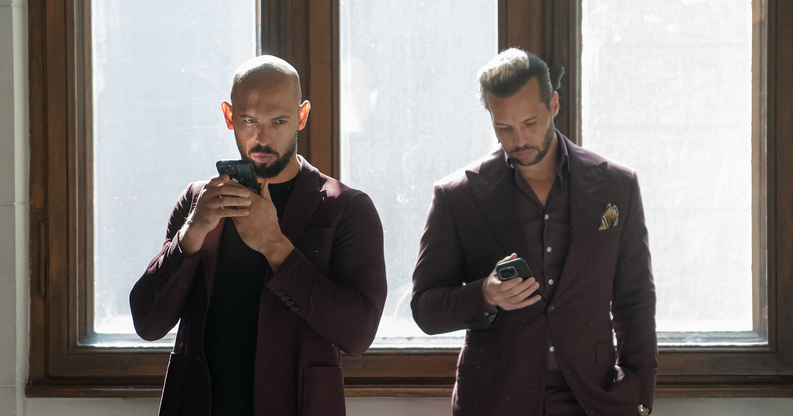

# Tate 兄弟承认没那么有钱，正面临引渡

> 怕进英国监狱，Andrew Tate 和他弟弟终于不装了：那些布加迪、游艇、名表，全是生意需要人设，并不是真有钱。

法庭文件里，兄弟俩把「富豪人设」亲手拆了。

## 人设翻车现场

Andrew Tate 和弟弟 Tristan Tate，这对靠制造争议吃饭的网红，最近在法庭文件里彻底丢掉了硬汉架子。面对可能落地的英国监禁，他们承认：自己就是一群虚荣的骗子。

在最近提交的法庭材料里，两人的律师直言，他们故意把自己包装得比实际富裕得多，因为「商业模式依赖网络关注度」。

那些开着兜风的布加迪？那些喝酒的游艇？那些招摇的表？律师在文件里写得很直白：都是假的。

## 「我们只是在演角色」

「Andrew 和 Tristan 是社交媒体人物。他们的商业模式依赖网络关注度，」律师在提交给《卫报》的文件里写道，「他们和关于他们的帖子越出格，越可能换来观看和点赞，进而变现。简而言之，他们在演一个角色。」

这不算意外。兄弟俩从头到脚透着「割韭菜」味，不比他们吐出的厌女言论少。但看他们被迫认下「狠人+不差钱」人设其实是一场扮演亿万富翁的游戏，还是挺好笑的。

比如他们拍视频的那艘超级游艇，其实是收了钱给船做的推广。「那艘『超级游艇』不属于 Tate 家，」律师澄清。车也不是自己的：「Tristan 视频里那辆 210 万美元的阿斯顿马丁、500 万和 700 万美元的布加迪，都是租的。」

至于 Andrew 多次明着吹自己帖子带来上亿美元收入？律师写的是：「这些帖子全是夸张。」

## 真罪名才是重点

兄弟俩上月被联邦法警在迈阿密逮捕，此前多年一直被多国调查。被捕后，英国皇家检察署对他们提出新指控，涉及 2010 至 2017 年间与四名女性相关的 alleged 违法行为。

Andrew Tate 的指控包括 7 项强奸、3 项性交易，以及十余项涉及儿童性图像和「极端色情」的罪名。兄弟俩在罗马尼亚也面临刑事指控，当地调查方称他们将女性诱骗进色情生意。

英国正在申请引渡，检察官以「有潜逃风险」为由，要求不放保释。

## 律师画风突变

和这副认怂姿态形成反差的，是兄弟俩律师 Joseph D. McBride 本月初的嚣张——他曾放话，若法院允许引渡，他会直接找特朗普政府插手（兄弟俩和特朗普关系很近）。

「我们会直接杀到特朗普总统办公室。」McBride 当时说。如今看来，那套狠话和「亿万富翁人设」一样，经不起法庭的盘问。
