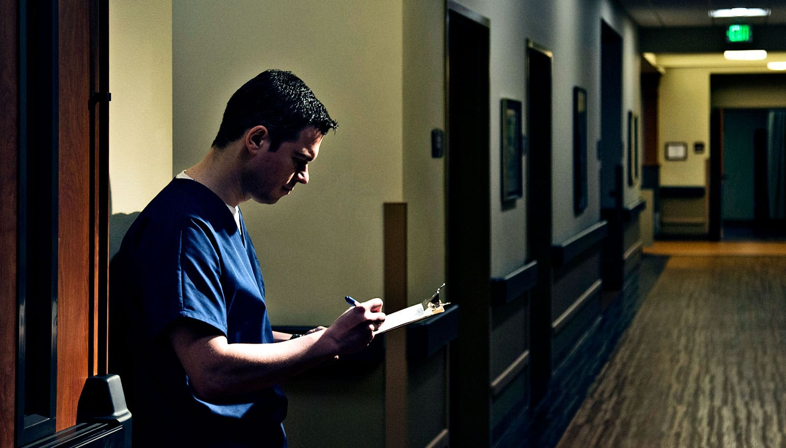

# 轮班护士少熬 30 分钟，睡眠质量和抗炎指标都变好

> 密苏里大学研究：把晚班 10pm–6am 改成 8pm–4am，炎症生物标记物显著下降，医生的睡眠也更“补”。

 一个小时的错位，可能让十年夜班不再结核、糖尿病和心病。

## 打破 10-6 的困局

医院的夜班从来不是“健康”的。Robertson 教授带领一组人把普通夜班医生们的作息，从传统的 10 pm – 6 am，改成了 8 pm – 4 am。

结果出乎意料地好：

- **白细胞 & 血小板** 降了 → 抗炎水平明显下降；
- **Fitbit** 数据显示睡眠更「恢复性」，醒来更没精打采。

## 那点改变怎么就这么管用

生物钟嘛，晚上该休息睡觉的，被扰乱就会点外圈疾病——心脏、癌症、糖尿病。

Roberson 自己说了：

> “我一开始就是看论文发现：夜班风险更高癌症、心脏、更早死亡。所以生物钟这个课题其实已经很重要。”

> “如果我们能证明换个排班真的让医生更健康，希望这个变化能推广到全医疗，甚至其他行业。”

## 干实验的是医生，结论也是医生

医院自己试出了这个结论，然后**投票决定保留新排班**，坚持到现在。Roberson 拟接着把同样的验证延伸到：

- 12 小时的护士群体；
- 其他医疜科的夜班人员。

论文发到了 *《美国急诊医学杂志》*。
