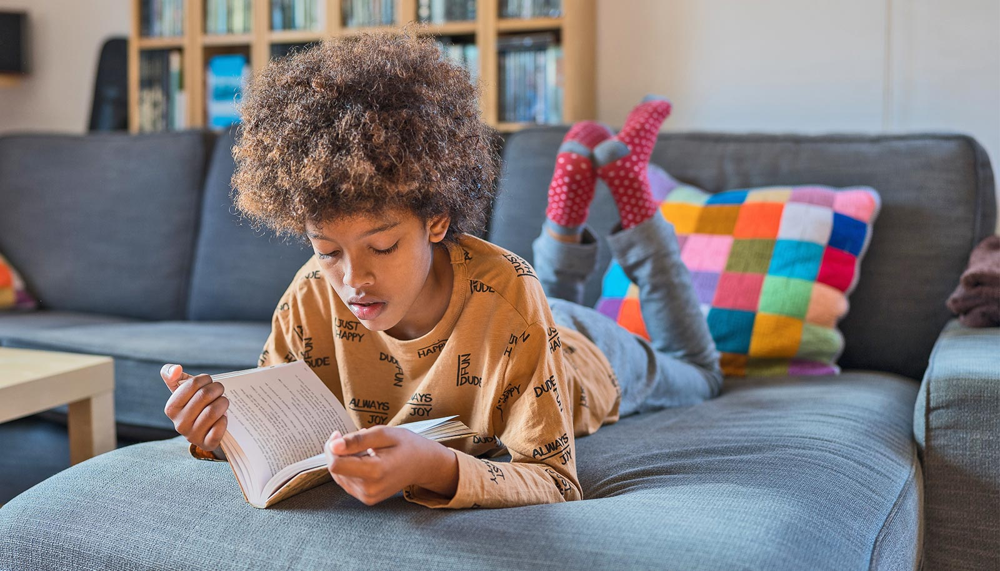

# 课间独自玩的孩子，可能比你想象的快乐

> 新研究发现：有些小学生看起来不合群，其实只是喜欢独处——只要他们知道自己属于集体、随时能加入，就不会孤独；真正不开心的是那些觉得"合群无所谓"的孩子。

 独处不等于被孤立，关键在于孩子知不知道自己"回得去"。

## 爱独处的孩子，心里有底

课间独自玩的那个孩子，也许正自得其乐。

佐治亚大学的这项新研究发现，一些看起来不合群的小学生其实只是偏好一个人待着——前提是，他们知道自己身处一个更大的社交圈里。这些孩子清楚，就算自己偶尔拒绝邀请，同伴们下次还是会叫上他们。这份笃定，成了抵御孤独感的缓冲垫。

反过来，那些认为"合群不重要"的孩子，对同伴关系并不满意。原因可能是他们看不到维持社交联系的理由，经常拒绝邀约，于是邀请渐渐不再上门，接着便开始感到被排斥和孤单。

研究者强调，重要的是让孩子知道自己融入同伴没问题，但别在他们不情愿时硬塞社交。"有些事我们做，是因为知道它对自己好。"研究合著者、佐治亚大学教育心理学系教授 Michele Lease 说，"我们去锻炼、吃蔬菜，可能并不想做，但知道该做。社交也一样——拒绝邀请就像逃避锻炼，结果只会更糟。"

## 473个四年级学生的答案

研究人员分析了佐治亚州多所小学473名四五年级学生的回答。孩子们被要求指出哪些同学"虽然跟谁都合得来，但更愿意一个人玩"，同时自评有多看重归属感，并汇报自己与单个朋友的友谊质量、以及在班级等大群体中的关系质量。

结果发现，被同伴标记为"不合群"的孩子里，不少人对自己的班级处境并不满意——午餐总是一个人坐、读书小组从不是第一个被想到的对象，这些事让他们难受。不过，这些退缩的孩子依然能维持不错的一对一友谊。研究者说，这当然是好事，但学会应对群体动态也是童年的重要一课。

"到四五年级，同伴圈子已经成型，孩子们的社交技能更强，互动经验也更丰富。"研究的通讯作者 Rachael Pfanz 说。她如今是一名小学心理老师，"在这个年纪，他们已经能分辨谁只是习惯自己玩，谁正在真的被孤立。"

## 会拒绝，也会答应

有意思的对照在这里：不把合群当回事的孩子，在友谊和班级两个层面都更容易对他人感到不满——研究者推测，他们拒绝更多邀请、越发退缩，换来的是与同伴越来越深的隔阂。

而那些看重归属感却偏爱独处的孩子，状态相当好：无论个人还是群体层面，他们都对自己的同伴关系感到满意。研究者分析，这可能因为这些孩子会接受足够的邀请来保持归属感，同时也敢于在不想玩时说不——反正以后有的是机会。

"这些孩子更喜欢自己待着做自己的事，但另一面是，他们跟谁都处得来。"Pfanz 说，"他们不会像另一群孩子那样总是拒绝邀请。被邀请时有时会参加，哪怕本来不太想去，那份对归属的重视也会推他们一把——而这恰恰对他们有好处。"

研究者建议老师和家长组织集体活动前想想这些发现，别急着把一个爱独处的孩子推进他不想要的场合。推一把的方向也很讲究："别一上来就让他们加入操场上的大足球赛，对一个本就偏好独处的孩子来说太吓人了。"Pfanz 说，"不如鼓励他们先加个行为习惯相近的小圈子，看看感觉如何。"
