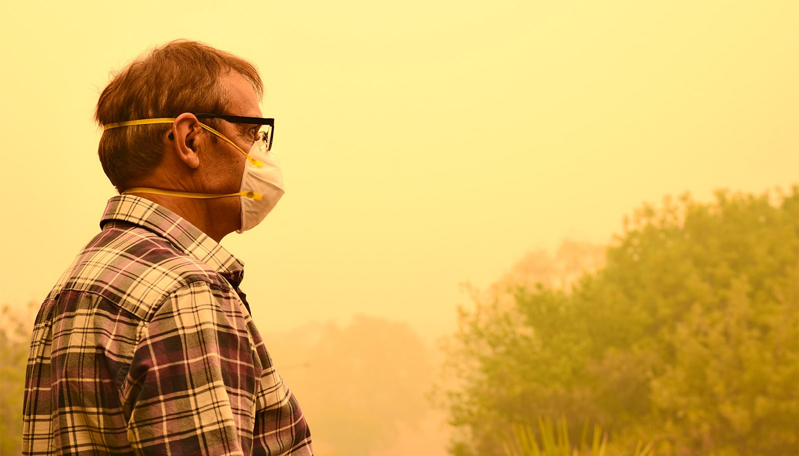

# 野火烟不只伤肺，长期吸入心脏也遭殃

> 耶鲁团队分析了6500万美国老年人的医保数据：野火烟细颗粒物连续几年累积暴露，与缺血性心脏病、心律失常、中风和心衰住院风险上升相关，心衰风险升幅超过20%。

 天空变橙色的那天只是开始，烟雾的账单会记在很多年后。

## 烟飘几百英里，账算在心脏上

随着气候变暖，野火变得更大、更频繁、更猛烈。烟雾如今动辄飘出数百英里——本月加拿大野火的浓烟横扫美国中西部和东北部，多个地区空气质量拉响警报。

但野火烟的健康代价，远不止对肺部的短期威胁。耶鲁大学的研究人员发现，反复且累积暴露于野火烟中的细颗粒物，与美国老年人因心血管疾病住院的风险升高相关。

研究覆盖了美国本土超过6500万 Medicare 受益人。结果显示，即便只是相对温和的烟雾水平，累积几年之后，也与缺血性心脏病、心律失常、中风和心衰等疾病的更多住院案例挂钩。

"换句话说，野火烟对心血管的消耗，远远超出火线范围，也远远不止天空变橙的那一天。"耶鲁大学公共卫生学院流行病学副教授、研究通讯作者 Kai Chen 说。论文发表在《美国心脏病学会杂志》（JACC）上。

## 以前只顾看肺，这次盯上了心

Chen 介绍，此前对野火烟的研究大多聚焦几天到几周内吸入烟雾的即时影响，而且主要盯着呼吸系统。已有研究表明，烟雾天急诊和住院确实更多，尤其是哮喘这类呼吸问题。

长期效应上，少量新研究开始把长期野火烟暴露与心血管死亡、以及新发心衰和中风联系起来。但这些早期研究大多没覆盖近几年——恰恰是野火活动和烟雾暴露急剧升级的年份；也没有覆盖全部心脑血管疾病类型。所以长期心血管影响——尤其是缺血性心脏病、心律失常这些具体亚型，以及对风险最高的老年人群——一直是悬而未决的问题。

心脏病是美国头号死因，研究者因此决定查清：反复的长期暴露到底对心血管做了什么，以及哪些人群背负了更重的份额。

## 六千五百万人的病历怎么读

他们构建了一项大型人群研究：使用2017到2022年美国本土全部65岁以上人口的 Medicare 记录，约6500万人。暴露数据则来自一个经过验证的模型——结合卫星影像、烟羽追踪和地面监测站，以10×10公里网格估算全国与烟雾相关的细颗粒物浓度（"烟雾 PM2.5"）。

研究按邮编把烟雾水平对应到每个人。由于关心的是长期暴露而非某一天的糟糕空气，他们计算了每个人此前三年的累计平均暴露量，并刻意剔除住院当年的数据——这样捕捉到的是慢性累积，而不是短期飙升。

健康端则追踪了研究对象的首次住院：总体心血管疾病，加上具体亚型——缺血性心脏病、中风及其他脑血管病、心衰和心律失常。统计模型估算了住院风险随烟雾暴露水平的变化，并仔细校正了其他空气污染、温度、湿度以及大量社区层面的社会经济因素。团队还按年龄、性别、种族和社会经济地位检查了风险差异，并跑了好几轮敏感性检验确保结果站得住。

结果很清晰：长期野火烟暴露与心血管住院风险升高明确相关。其中心衰的关联最强，高暴露组风险高出20%以上；而中风——尤其是缺血性中风——的风险随暴露增加持续攀升。

## 轻烟区也别大意

有两个发现让研究者格外在意。第一，即便在相当温和的烟雾水平下，长期风险也在上升——这意味着只被轻烟扫过的社区，而不只是火场周边，同样面临实实在在的心血管风险。第二，这份负担分得并不公平：社会经济地位较低的人群可能更加脆弱，暴露的分配存在真实的公平性问题。

"野火烟应该被当作不只是暂时的呼吸道刺激物。"耶鲁医学院医学教授、研究合著者 Harlan Krumholz 说，"研究发现累积暴露与老年人心血管住院风险升高相关。临床医生应帮助高危患者为烟雾事件做准备，公共卫生负责人则应扩大及时预警、洁净空气空间和有效过滤设备的覆盖——尤其是资源匮乏的社区。"

这些发现提示，"保护肺的措施同样在保护心脏"，共同资深作者、耶鲁医学院医学副教授 Yuan Lu 说。具体包括关注本地空气质量、污染重时待在室内、开空气净化器或布置"洁净空气房"、减少剧烈户外活动，外出时戴贴合的 N95 或 KN95 口罩。
