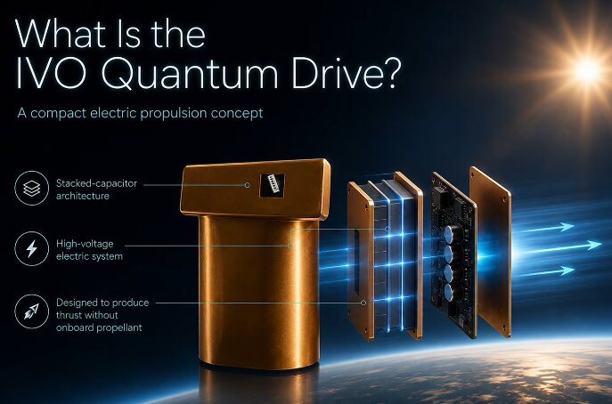

# 量子驱动轨道实验，真有推力还是新能干？

> Mike McCulloch 声称 IVO 的轨道飞行，推力“在可信范围”，但坦认没拿到决定性证据。

 一次来到太空的“古怪实验”，还是只能当作“尚未证伪”。

## 背景

- 2019: IVO CEO Richard Mansell 联系 Mike McCulloch；
- 凭借 capacitor 实验为基础，IVO 开发出自己的 stacked-capacitor hardware；
- 合作 Rogue Space Systems，上轨道做验证。

## 两次发射，一地鸡零

- **2023 年 11 月**：搭上 Rogue 公司 BARRY-1，Transporter-9；
  → 主机通信故障，驱动从未启动。

- **2025 年 3 月**：OTP-2，Transporter-13；
  → 团队声称捕获到推力，但硬件故障限制操作 < 1 min/天。

## Mike 的统计分析

Mike 拿 IVO 的轨道数据，和**同一类型的卫星**进行对比：

- IVO 航卫在 **3 个月内落后 600 米**；
- 残余差距在 **“intermittent drive” 模式预期范围** 内；

> “但结果**不确定**，可能是 Lorentz force 造成。”

## Science 还是信仰？

- McCulson 推出 **Quantized Inertia (QI)**: 用加速度 + Unruh 辐射 + 量子真空模式限制解释 inertia；
- 应用方向：galaxy rotation, particle mass, thrust test, future propulsion。

## 结论

- 量子驱动到底行不行，**没有结论**；
- Mike 自己也说：“**不是结论性的结果**”，可能只是一个“ intriguing anomaly”。
