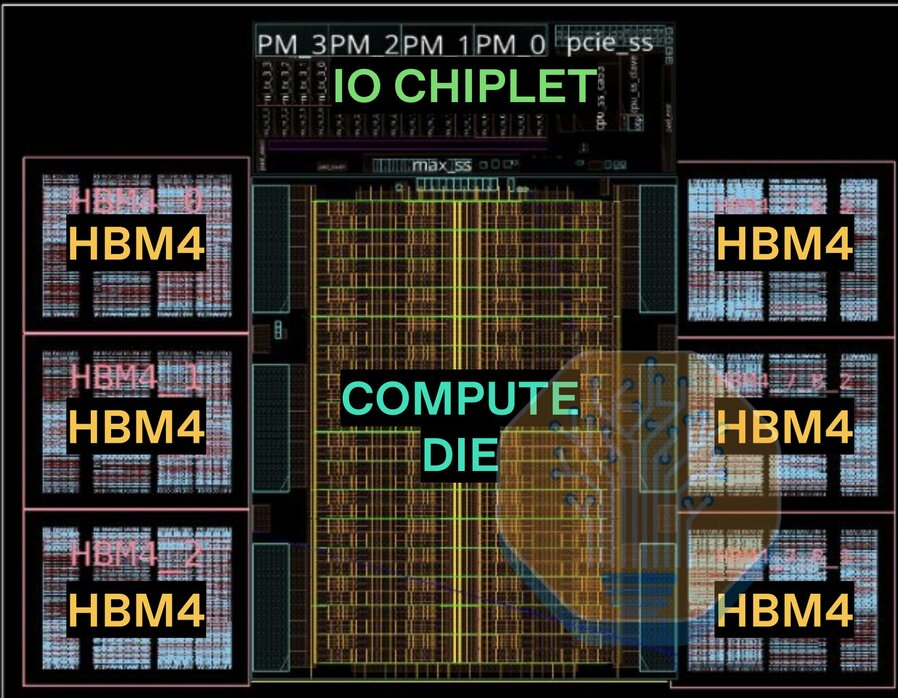

# OpenAI首颗自研推理芯片Jalapeño亮相Hot Chips

> OpenAI 与博通合作的首款 LLM 推理专用芯片 Jalapeño 在 Hot Chips 大会公布数据：峰值吞吐下每瓦性能是对比系统的1.5-1.9倍，端到端延迟低1.7-3.6倍，交互式负载性能高2.1-4.1倍。

 从组队到流片只用了16个月，OpenAI 的第一颗芯片来了。

## 专为推理而生，16个月流片

今年6月，OpenAI 首次公开了与博通合作的芯片计划：从零开始设计、专攻大模型推理的 ASIC。设计工作2024年年中启动，从最初的团队组建到制造流片只用了约16个月——在 ASIC 开发周期里算得上极速。

在 Hot Chips 大会上公布的实测数据显示，Jalapeño 在峰值吞吐下每瓦能完成的AI工作量是对比系统的1.5到1.9倍；端到端延迟低了1.7到3.6倍。对聊天机器人这类高度交互的负载，性能优势进一步拉大到2.1到4.1倍。

## 但对手不该是 Blackwell

Semianalysis 认为，这轮对比对象选得不太公平，结论也打了折扣：拿 Jalapeño 对标 Blackwell 并不完整，它真正的竞品是同样用上 HBM4 内存的芯片，比如英伟达的 Rubin。而 Vera Rubin 系统现在已经开始向客户出货了。

一个值得参考的数字：Vera Rubin NVL72 的每兆瓦性能是上一代 GB200 NVL72 的5.4倍。也就是说，Jalapeño 想证明自己，得先迈过工程样品这一关，把量产规模铺起来——纸面数据漂亮和数据中心里真金白银地省电省钱，中间还隔着整个供应链。
