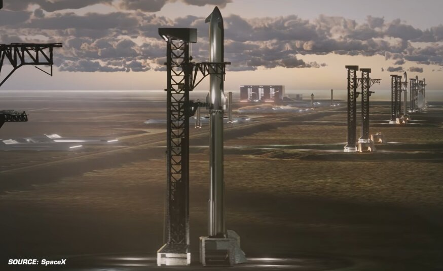

# SpaceX在建的星舰发射工位已达17个，年发射能力超1.5万次

> 把路易斯安那 Starbase 算上，SpaceX 手里共有17个星舰发射工位在开发中，全部建成后合计年发射能力超过1.5万次——是人类有史以来火箭发射总量的两倍还多。

 星舰发射场的图纸正在越摊越大。

## 17个工位，一条比一条猛

据 SpaceX 观察者 Sawyer Merritt 8月25日汇总，SpaceX 目前共有17个星舰发射工位处于开发状态。这17个工位全部建成后，合计发射能力将超过每年1.5万次——比人类整个航天史上所有火箭发射次数的总和还要多两倍不止。

其中最受瞩目的是计划中的百亿美元级"Starbase Louisiana"（路易斯安那星舰基地）：它将拥有10个发射工位（5个综合发射设施、每个2个工位），计划2027年动工，目标2029年首飞。

## 钱要等2029年才开始进账

新发射设施不会立刻带来收入。按目前的排期，这些场地要到2029年才可能产生正向营收——而且前提是工程不延期。换句话说，未来几年是纯投入期，赌的是星舰运营化之后的发射需求能吃满这些工位。

从得克萨斯到佛罗里达再到路易斯安那，SpaceX 正在把星舰发射场当成流水线来铺。如果1.5万次的年发射能力真的落地，太空运输的成本曲线将被再改写一次；而在那之前，先得把17张施工图纸一张张变成混凝土和钢铁。
