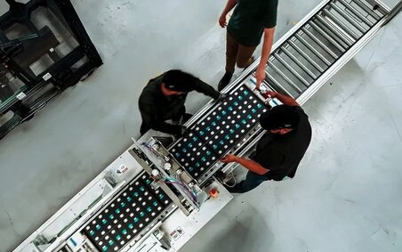

# 钠离子电池量产了，CATL 称它比 LFP 更便宜更安全——但缺点是跑不远

> 用食盐里能提炼的钠，做出能量密度 175 Wh/kg、寿命超 10000 次、冬天表现更好的动力电池。今年国内上了 60GWh 订单。

 离铁被碟中正击。

## 价格战刚打响

- **60 GWh** 大单签给 HyperStrong；
- CATL 市占 **28-30%**；
- BYD 紧追第 2 名，目标 **30-50 GWh**；
- 其他玩家还有 Faradion（英）, Altris（瑞）, Tiamat（法）, Farasis。

## 技术参数：能撑天涯

| 参数 | 钠离子 | LFP |
|------|--------|-----|
| 能量密度 | ~175 Wh/kg | 160–180 Wh/kg |
| 循环寿命 | 10,000–15,000 次 | 类似 |
| 低温 | 强 | 弱 |
| 单价（估值 2026） | $50–56/kWh | — |
| 安全性 | 热稳定 + 低燃 | — |

Prototype 已经冲到 **200 Wh/kg**。

## 冷天开火更容易

钠离子在寒户外表现尤其优异，“Strong cold-weather performance”，直接决定了北方地区的适用性。

## 美国也想插上一脚

- Peak Energy 建了一座 **18.3 万平方英尺** 工厂，年产 **4 GWh**；
- 投资 **7100 万美刀**，目标：**2027 Q1 交付**；
- 已有 **multi-GWh 订单** 在手；
- Passively cooled，专攻 **grid + data-center**, 追求 cost + reliability。

## 缺点？就是续航里程

钠离子现在只能先攻：

- 电网储能；
- 低速/入门 EV。

真正的轿车上盘，离 200 公里还是有距离。

## 结论

钠离子是“**更便宜+更安全+寿命更长**”，但在 **续航** 上还是弱。

它不是要取代锂电，而是给它**另外一条赛道**：低成本、低温、高循环。
