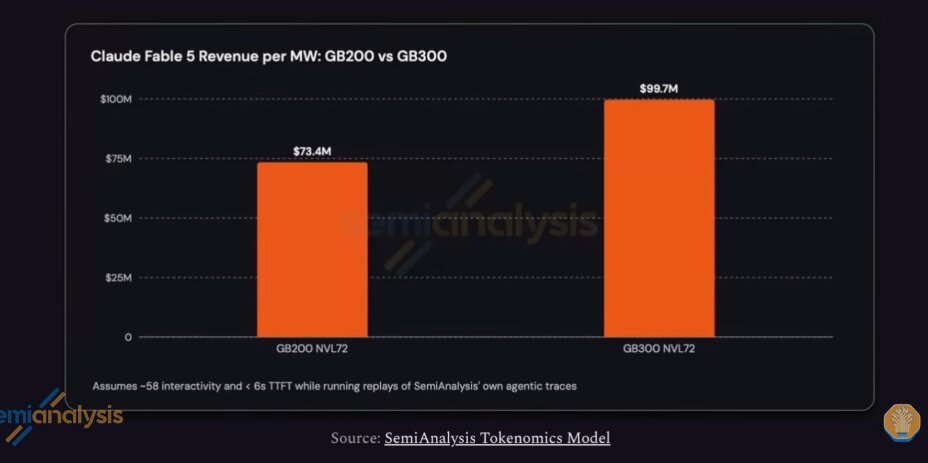

# SpaceX 囤了 10GW 算力基地， SemiAnalysis 称它能靠超短交付赚 100M/每 MW

> Google 已经订了“应急上电”合约：$14/小时 vs 市场 $3/小时，90 天后悔 clause 也拉满。

 唯一不缺的就是时间：SpaceX 能不能盖出这么多电？

## SemiAnalysis：SpaceX 已经下了 8-10GW 的能源订单

- 已锁潜在 7+ GW 现有的 Turbine + 未来 1-2 GW 新增；
- 总量约 **10 GW**，2027 年投产。

## 定价：“加急”带着天价

| 维度 | 行情 | SpaceX 报价 |
|------|------|-------------|
| 常规 | ~$12-15M / MW + 5 年 IAAS | |
| Google | ~$3/hr/GB200-class | **$14/hr** — 4.5x |
| **估算** | | **$50M / MW/yr** 给客户 |

Semianalysis 称：

> “SpaceX/Google 的价格意味着买方在**非常强的预期回报**下签单。”

## Google 合约的“逃跑条款”

- **90 day cancellation**，基本等于“试用”；
- 90 天不满意就走人，**risk 几乎为零**。

## SpaceX 怎么赶这么快？

- **用地快**：已有 warehouse zoned，拆改立即动手；
- **设备便宜**：来自中国、预制、Elon 3-4x less people；
- **能源灵活**：中继 turbine / 私人传输线，远离原电厂。

> “Unconventional and pragmatic.” —— SemiAnalysis

## 其他玩家的窘境

- Anthropic / OpenAI / Microsoft 三脚独角：想靠 token 换钱，SpaceX 直接拿算力；
- Microsoft 自己停下 7-8 GW 扩张，2026-H1 2027 缺口很大。

## 风险点

Semianalysis 指出：

> “**SpaceX 能交付吗？** 地点/电/人/设备/融资 —— 六大要素。”

他们翻了 100 万条土地记录，找候选地，但 **DOJ 介入** 的例子也出现过。

## 结论

SpaceX 是 **唯一** 能在“几年之内”产出 10GW 的玩家；

价钱贵但**应急上电 = 定价权**；

唯一问题：**能不能盖完？**
