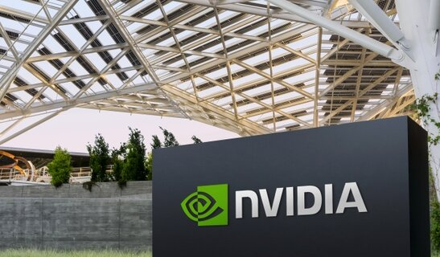

# 英伟达第二季度营收962亿美元、同比翻倍，数据中心几乎吃下整块蛋糕

> 英伟达2026财年第二季度营收962亿美元，同比飙升106%、环比增长18%，数据中心独揽890亿美元，全年指引继续上探至1080亿。

 英伟达2026财年第二季度业绩创下历史新高。

## 营收与利润：每一项都压过华尔街预期

7月26日收官的财年第二季度，英伟达交出了一份几乎挑不出毛病的成绩单。营收962亿美元，比一年前多出整整一倍（106%），也比上一季度高出18%。市场原本预期约922亿美元——实际数字高出40亿。

赚钱能力同样吓人。GAAP 与非 GAAP 毛利率同为75.0%，比去年同期抬升250个基点。摊薄每股收益 GAAP 2.46美元、非 GAAP 2.22美元，其中调整后每股收益同比暴涨120%，同样轻松越过2.10美元的共识预期。

## 数据中心仍是那台印钞机

真正撑起这门生意的，还是数据中心。本季度数据中心收入890亿美元，同比增长117%，比市场预期的858亿高出一截。边缘计算贡献72亿美元，同比增长27%——规模虽小，却是个稳健的增长点。

利润结构也足够健康：调整后营业利润640亿美元（+124%），净利润540亿美元（+118%），自由现金流213亿美元。账上现金及等价物224亿美元，长短期债务合计33.4亿美元，财务面相当从容。

## Vera Rubin 平台全面投产，AI 工厂开始换血

硬件层面，Vera Rubin 平台已进入全面量产。机架在 CoreWeave、谷歌云、微软 Azure、甲骨文云和 Nebius 等合作方处跑了起来。配套的 Spectrum-6 交换系统——同时支持可插拔与共封装光模块——正部署到全球那些"吉斯卡级"AI 工厂里。

英伟达还揭开了 Vera 的面纱：这是首款为 AI 智能体打造的 CPU，已被多家头部科技公司列入采用计划。面向交互式推理的 Groq 3 LPX 加速卡也宣布进入全面量产。SpaceXAI 则将在下一代智能体应用中部署 Vera CPU。

## 5000亿美元外部资本入场，算力基建进入"借钱扩张"时代

最值得玩味的，是英伟达拉来的一支资本豪华阵容。它与 Apollo、贝莱德、黑石、Brookfield、高盛和 KKR 达成战略合作，目标是撬动超过5000亿美元的第三方资本，专门用于 AI 基础设施的建设——当然，这还要等最终协议落定。

第三季度指引同样不保守：营收1080亿美元（±2%），高于1042亿的市场预期；毛利率预计74.0%（±50基点），运营开支约90亿。

当一家芯片公司的财报能牵动半个科技业的神经，你就知道算力早已不是元器件生意，而是一场关于未来的军备竞赛。夜幕下的数据中心机房，指示灯仍以肉眼难辨的速度明灭——那里烧着的，是全世界对智能最炽热的赌注。
